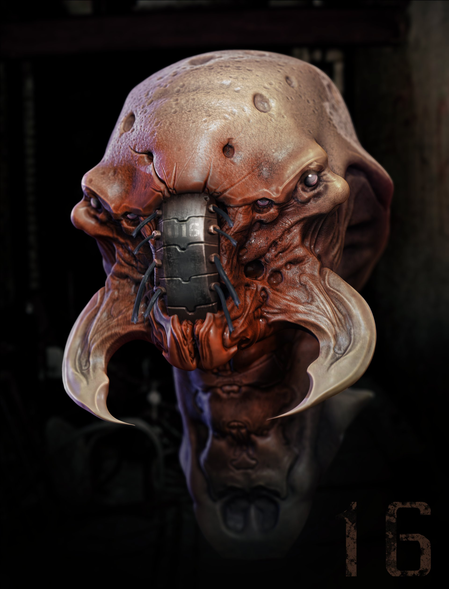

# Brain Destroyer Ant

As a kid he liked to play with ants, after graduating Medical School, he begins to make human experiments with ant DNA. after he was diagnosed with an incurable disease, he decided to insert ant DNA into himself which made him evil.

## Powers and weaknesses

- ➕ Very fast and can shrink up to 2 cm
- ➕ he can reach easily the brain and control it 
- ➖ Is very fragile

